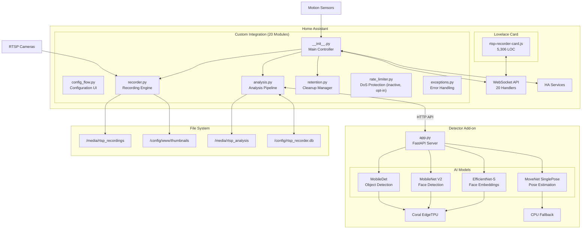
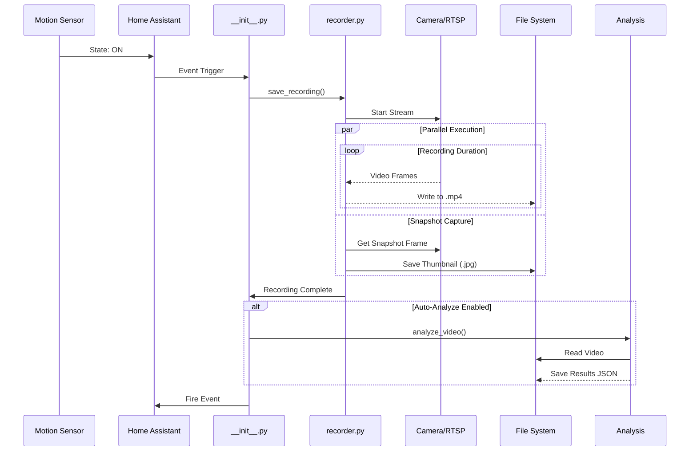
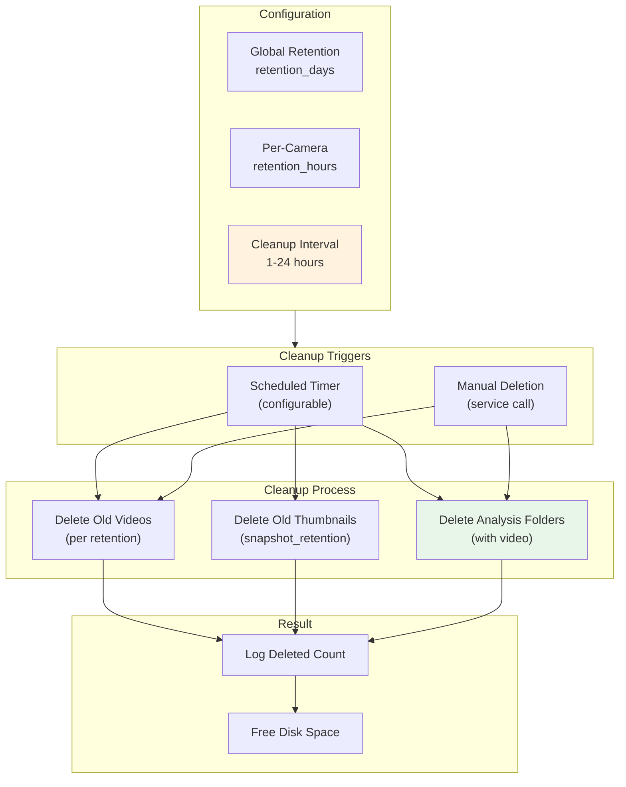
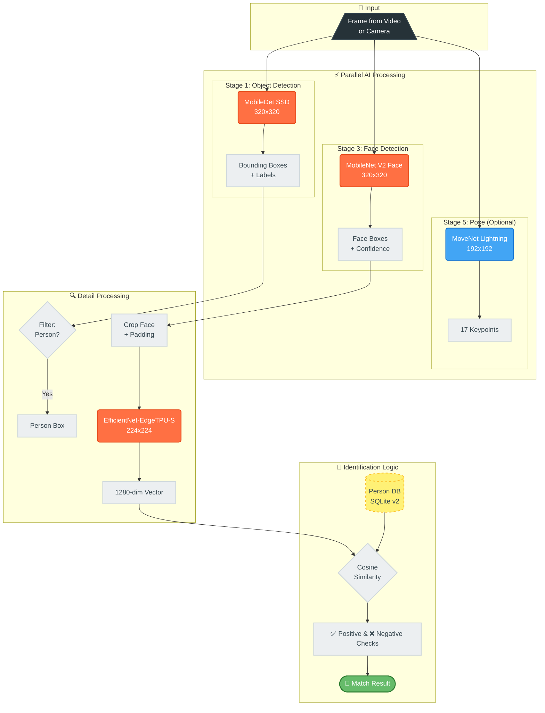
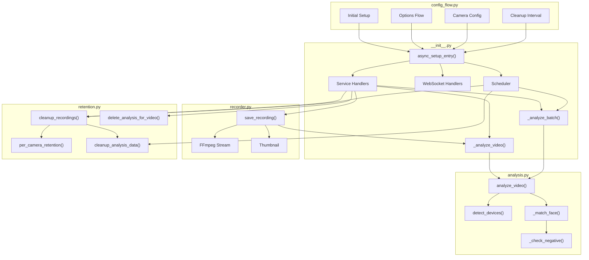
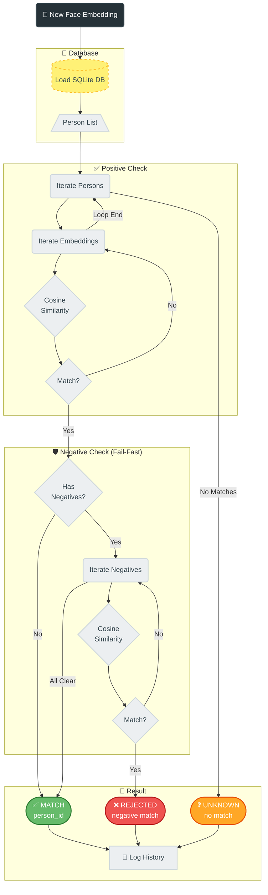
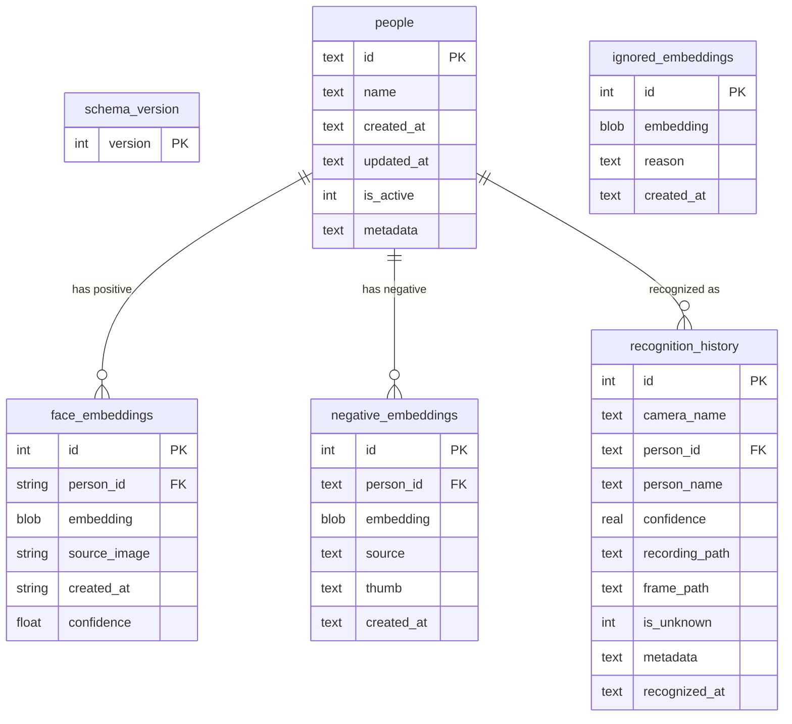

# Opening RTSP Recorder for Home Assistant

<div align="center">
  
</div>

A complete video surveillance solution with AI-powered object detection using Coral USB EdgeTPU.


📋 **[Audit Report v1.3.1](docs/FINAL_AUDIT_REPORT_v1.3.1.md)** | **[DE](docs/FINAL_AUDIT_REPORT_v1.3.1_DE.md)** - Quality & Security tested according to ISO 25010:2011 (31 criteria) + ISO 27001:2022 (16 controls) (15.02.2026)
🔒 **[Security Policy](SECURITY.md)** - Biometric Data Handling & Responsible Disclosure

## What's New in v1.3.4

### 📱 Mobile Video Loading Fix (v1.3.3-v1.3.4)
- **Root Cause Fixed**: RTSP recording produced fragmented MP4 (fMP4) — mobile browsers had to download entire 17 MB files before playback (~10s delay)
- **Post-Recording Remux**: Each recording is automatically remuxed to regular MP4 with `faststart` (<1 second, no re-encoding)
- **Video Streaming Endpoint**: New `/api/rtsp_recorder/video/` with HTTP Range/206 support for true progressive playback
- **Dashboard Card**: Uses custom video endpoint with automatic fallback
- **Batch Migration**: All 497 existing videos converted successfully

### 🐛 v1.3.2: Mobile Video UX
- Poster frame, loading spinner, `canplay` event handling for smoother video loading experience

### 🐛 v1.3.1: Debug Mode Bugfix
- Performance panel visibility fixed when toggling Debug Mode

### 🏷️ Rebranding: "Opening RTSP Recorder" (v1.3.0)
**Unified branding for better recognition:**
- **Integration**: "Opening RTSP Recorder" (v1.3.0)
- **Addon**: "Opening RTSP Recorder Detector" (v1.1.0)
- All translations (DE, EN, FR, ES, NL) updated
- Setup dialogs show the new name

---

<details>
<summary><b>📋 Full Changelog (v1.0.6 - v1.2.9)</b></summary>

See **[CHANGELOG.md](CHANGELOG.md)** for the complete version history including:
- v1.3.4: Version bump - mobile fix confirmed
- v1.3.3: Mobile Video Loading Root Cause Fix (fMP4 remux)
- v1.3.2: Mobile Video UX (poster, spinner, canplay)
- v1.2.8: Debug Mode for Technical Displays
- v1.2.7: Smart Dashboard Card Auto-Update
- v1.2.6: Automatic Dashboard Card Installation
- v1.2.5: Correct Video FPS Metadata
- v1.2.4: Dynamic Thumbnail Path Loading
- v1.2.3: 100% Type Hints, Stats Display Fix
- v1.2.2: Statistics Reset, Mobile Portrait View
- v1.2.1: Cyclomatic Complexity Reduction
- v1.2.0: Sample Quality Analysis, Multi-Sensor Trigger
- v1.1.x: Person Detail Popup, HA Person Entities
- v1.0.x: SQLite Backend, Face Detection

</details>

### 📖 Ring Camera Privacy Documentation

> [!IMPORTANT]
> **Why we developed RTSP Recorder: Local recording without cloud!**

```
                        ┌─────────────────────┐
                        │    RING CAMERA      │
                        │    (Front Door)     │
                        └─────────┬───────────┘
              ┌───────────────────┼───────────────────┐
              ▼                   ▼                   ▼
    ┌─────────────────┐ ┌─────────────────┐ ┌─────────────────┐
    │    RING APP     │ │  RING WEBSITE   │ │  RTSP STREAM    │
    │    opens        │ │    ring.com     │ │    (local)      │
    └────────┬────────┘ └────────┬────────┘ └────────┬────────┘
             ▼                   ▼                   ▼
    ┌─────────────────┐ ┌─────────────────┐ ┌─────────────────┐
    │ Snapshot is     │ │ Snapshot is     │ │ No data         │
    │ fetched from    │ │ fetched from    │ │ transfer to     │
    │ camera          │ │ camera          │ │ Amazon          │
    └────────┬────────┘ └────────┬────────┘ └────────┬────────┘
             ▼                   ▼                   ▼
    ┌─────────────────┐ ┌─────────────────┐ ┌─────────────────┐
    │ Via ring.com    │ │ Via Amazon      │ │ Local           │
    │ API             │ │ CDN (direct)    │ │ Storage         │
    └────────┬────────┘ └────────┬────────┘ └────────┬────────┘
             ▼                   ▼                   ▼
    ┌─────────────────┐ ┌─────────────────┐ ┌─────────────────┐
    │ ✅ BLOCKABLE   │ │ ❌ NOT         │ │ ✅ COMPLETELY   │
    │ with Pi-hole    │ │ BLOCKABLE       │ │ LOCAL           │
    │ (ring.com)      │ │ (amazonaws.com) │ │ (Home Assistant)│
    └─────────────────┘ └─────────────────┘ └─────────────────┘
```

**Documentation on Amazon data flow with Ring cameras:**
- What data flows to Amazon and when
- Premium vs. Non-Premium subscription differences  
- Pi-hole blocking configuration

👉 **[Ring Amazon Data Flow Documentation](docs/RING_AMAZON_DATAFLOW.md)** | 🇩🇪 **[Deutsche Version](docs/RING_AMAZON_DATAFLOW_DE.md)**

---

### 💰 Save Money: Cloud Subscription Costs vs. Local Recording

> [!TIP]
> **RTSP Recorder = €0/year** - Save up to €200/year compared to Ring Premium!

Replace expensive cloud subscriptions (Ring €200/yr, Nest €100/yr, Arlo €150/yr) with local recording. Your data stays private, and your wallet stays full.

| Provider | Yearly Cost | With RTSP Recorder | **Savings** |
|----------|-------------|-------------------|-------------|
| Ring Premium | €199.99 | €0 | **€200/yr** |
| Google Nest | ~€100 | €0 | **€100/yr** |
| Arlo Secure | ~€100-150 | €0 | **€150/yr** |

📖 **Full details:** [English](docs/CLOUD_SUBSCRIPTION_COSTS.md) | [Deutsch](docs/CLOUD_SUBSCRIPTION_COSTS_DE.md)

> ⚠️ **Ring users:** Use [ring-mqtt](https://github.com/tsightler/ring-mqtt) Add-on to get RTSP streams from your cameras!

---

## What's New in v1.3.4

📱 **Mobile Video Fix** - Instant video playback on mobile (fMP4 → MP4 remux + HTTP Range support)

📋 **[Full Release History](docs/RELEASE_HISTORY.md)** | **[Detailed CHANGELOG](CHANGELOG.md)**

---

## Version Comparison (Recent Releases)

| Feature | v1.3.1 | v1.3.2 | v1.3.3 | v1.3.4 |
|---------|--------|--------|--------|--------|
| **Mobile Video Fix** | ❌ | 🔄 UX only | ✅ Root cause | ✅ |
| **Video Streaming Endpoint** | ❌ | ❌ | ✅ NEW | ✅ |
| **Post-Recording Remux** | ❌ | ❌ | ✅ NEW | ✅ |
| **HTTP Range/206 Support** | ❌ | ❌ | ✅ NEW | ✅ |
| **Debug Mode Fix** | ✅ | ✅ | ✅ | ✅ |
| **Opening Branding** | ✅ | ✅ | ✅ | ✅ |
| **Push Notifications** | ✅ | ✅ | ✅ | ✅ |
| **Type Hints** | 100% | 100% | 100% | 100% |
| **ISO 25010 Score** | 94/100 | 94/100 | 94/100 | 94/100 |
| **ISO 27001 Score** | 88/100 | 88/100 | 88/100 | 88/100 |
| **Production Ready** | ✅ | ✅ | ✅ | ✅ |

### ⚡ Performance Optimizations
- **Parallel Snapshots**: Thumbnails captured DURING recording
  - Saves 3-5 seconds per recording
  - Configurable `snapshot_delay` for best frame capture
- **Callback-based Recording**: Event-driven completion instead of polling
  - Uses `asyncio.Event()` for instant FFmpeg completion notification
  - Eliminates busy-waiting loops
- **Faster Timeline**: Recordings appear immediately when started
  - New `rtsp_recorder_recording_started` event
  - Live recording badge with countdown timer

### 📊 Metrics & Monitoring
- **TPU Load Display**: Real-time Coral EdgeTPU utilization
  - Formula: (Coral inference time / 60s window) × 100
  - Color coded: 🟢 <5% | 🟠 5-25% | 🔴 >25%
- **Performance Metrics**: Structured logging for analysis
  - `METRIC|camera|recording_to_saved|32.1s`
  - `METRIC|camera|analysis_duration|6.2s`
  - `METRIC|camera|total_pipeline_time|45.3s`
- **Recording Progress**: Live display in footer showing active recordings

### 🔧 Technical Improvements
- Inference stats history: 100 → 1000 entries (better TPU load accuracy)
- CPU reading: 0.3s sampling with rolling average (smoother values)
- File stability: 1s intervals, 2 checks (faster analysis start)
- HA camera wait: +1s instead of +2s (reduced latency)

## Features (All Versions)

### Recording & Storage
- 🎥 **Motion-triggered recording** from RTSP cameras
- � **Multi-Sensor Trigger** support (motion, doorbell, etc.)
- ⚡ **Parallel recording & snapshot capture** for instant timeline updates
- 📁 **Automatic retention management** for recordings, snapshots, and analysis
- ⏱️ **Configurable recording duration** and snapshot delay
- 🗂️ **Per-camera retention settings** override global defaults
- 🧹 **Configurable cleanup interval** (1-24 hours)

### AI Detection
- 🔍 **AI object detection** with Coral USB EdgeTPU support (MobileDet)
- 🧠 **CPU fallback mode** when Coral unavailable
- 🙂 **Face detection** with MobileNet V2
- 🎯 **Face embeddings** for person recognition (EfficientNet-EdgeTPU-S)
- 🏃 **MoveNet pose estimation** for head/body keypoint detection
- 🎚️ **Per-camera detection thresholds** (detector, face confidence, face match)
- ⚙️ **Configurable object filter** per camera (person, car, dog, etc.)

### Person Management
- 👤 **Person database** with training workflow
- 📲 **Push Notifications** with images for known persons
- 📊 **Sample Quality Analysis** with outlier detection
- ✅ **Positive samples** for face matching
- ❌ **Negative samples** to prevent false matches (threshold: 75%)
- 🚦 **Optional person entities** for Home Assistant automations
- 🏷️ **Rename and delete** persons from dashboard

### Analysis & Scheduling
- ⏰ **Automated analysis scheduling** (daily time or interval-based)
- 📊 **Batch analysis** for all recordings with filters
- 🔄 **Skip already analyzed** option for efficiency
- 📈 **Live performance monitoring** (CPU, RAM, Coral stats)
- 🧹 **Automatic analysis cleanup** with video deletion

### Dashboard
- 🎛️ **Beautiful Lovelace card** with video playback
- 📱 **Mobile-optimized portrait layout** with timeline
- 🖼️ **Timeline view** with thumbnails
- 🔴 **Detection overlay** with smooth animations
- 👥 **Persons tab** with quality scores and bulk management
- ⚡ **Real-time detector stats** panel
- 📊 **Movement profile** with recognition history

## Architecture

### System Overview


```mermaid
flowchart TB
    subgraph HA["Home Assistant"]
        subgraph Integration["Custom Integration (20 Modules)"]
            INIT["__init__.py<br/>Main Controller"]
            CONFIG["config_flow.py<br/>Configuration UI"]
            RECORDER["recorder.py<br/>Recording Engine"]
            ANALYSIS["analysis.py<br/>Analysis Pipeline"]
            RETENTION["retention.py<br/>Cleanup Manager"]
            RATELIMIT["rate_limiter.py<br/>DoS Protection (inactive, opt-in)"]
            EXCEPTIONS["exceptions.py<br/>Error Handling"]
        end
        
        subgraph Dashboard["Lovelace Card"]
            CARD["rtsp-recorder-card.js<br/>5,306 LOC"]
        end
        
        WS["WebSocket API<br/>20 Handlers"]
        SERVICES["HA Services"]
    end
    
    subgraph Addon["Detector Add-on"]
        APP["app.py<br/>FastAPI Server"]
        subgraph Models["AI Models"]
            DETECT["MobileDet<br/>Object Detection"]
            FACE["MobileNet V2<br/>Face Detection"]
            EMBED["EfficientNet-S<br/>Face Embeddings"]
            POSE["MoveNet SinglePose<br/>Pose Estimation"]
        end
        CORAL["Coral EdgeTPU"]
        CPU["CPU Fallback"]
    end
    
    subgraph Storage["File System"]
        RECORDINGS["/media/rtsp_recordings"]
        THUMBS["/config/www/thumbnails"]
        ANALYSISDIR["/media/rtsp_analysis"]
        SQLITE["/config/rtsp_recorder.db"]
    end
    
    CAM["RTSP Cameras"] --> RECORDER
    MOTION["Motion Sensors"] --> INIT
    
    INIT --> RECORDER
    INIT --> ANALYSIS
    INIT --> RETENTION
    INIT <--> WS
    INIT <--> SERVICES
    
    CARD <--> WS
    
    ANALYSIS <-->|HTTP API| APP
    APP --> DETECT
    APP --> FACE
    APP --> EMBED
    APP --> POSE
    
    DETECT --> CORAL
    FACE --> CORAL
    EMBED --> CORAL
    POSE --> CPU
    
    RECORDER --> RECORDINGS
    RECORDER --> THUMBS
    ANALYSIS --> ANALYSISDIR
    ANALYSIS <--> SQLITE
```

### Recording Flow


```mermaid
sequenceDiagram
    participant MS as Motion Sensor
    participant HA as Home Assistant
    participant INIT as __init__.py
    participant REC as recorder.py
    participant CAM as Camera/RTSP
    participant FS as File System
    participant AN as Analysis
    
    MS->>HA: State: ON
    HA->>INIT: Event Trigger
    INIT->>REC: save_recording()
    REC->>CAM: Start Stream
    
    par Parallel Execution
        loop Recording Duration
            CAM-->>REC: Video Frames
            REC-->>FS: Write to .mp4
        end
    and Snapshot Capture
        REC->>CAM: Get Snapshot Frame
        REC->>FS: Save Thumbnail (.jpg)
    end
    
    REC->>INIT: Recording Complete
    
    alt Auto-Analyze Enabled
        INIT->>AN: analyze_video()
        AN->>FS: Read Video
        AN-->>FS: Save Results JSON
    end
    
    INIT->>HA: Fire Event
```

### Analysis Pipeline


```mermaid
flowchart LR
    subgraph Input
        VIDEO["Video File<br/>.mp4"]
    end
    
    subgraph FrameExtraction["Frame Extraction"]
        EXTRACT["Extract Frames<br/>every N seconds"]
    end
    
    subgraph Detection["Object Detection"]
        DETECT["MobileDet<br/>Coral/CPU"]
        FILTER["Object Filter<br/>person, car, etc."]
    end
    
    subgraph FaceProcessing["Face Processing"]
        FACEDET["Face Detection<br/>MobileNet V2"]
        FACEEMBED["Face Embedding<br/>EfficientNet-S"]
    end
    
    subgraph PersonMatching["Person Matching"]
        LOADDB["Load Person DB"]
        POSITIVE["Check Positive<br/>Samples"]
        NEGATIVE["Check Negative<br/>Samples ≥75%"]
        MATCH["Final Match<br/>Decision"]
    end
    
    subgraph Output
        RESULT["Analysis Result<br/>.json"]
    end
    
    VIDEO --> EXTRACT
    EXTRACT --> DETECT
    DETECT --> FILTER
    FILTER -->|person detected| FACEDET
    FACEDET --> FACEEMBED
    FACEEMBED --> LOADDB
    LOADDB --> POSITIVE
    POSITIVE -->|similarity > threshold| NEGATIVE
    NEGATIVE -->|not excluded| MATCH
    MATCH --> RESULT
    FILTER -->|other objects| RESULT
```

### Cleanup/Retention System (v1.1.0k)


```mermaid
flowchart TB
    subgraph Config["Configuration"]
        GLOBAL["Global Retention<br/>retention_days"]
        PERCAM["Per-Camera<br/>retention_hours"]
        INTERVAL["Cleanup Interval<br/>1-24 hours"]
    end
    
    subgraph Trigger["Cleanup Triggers"]
        TIMER["Scheduled Timer<br/>(configurable)"]
        DELETE["Manual Deletion<br/>(service call)"]
    end
    
    subgraph Cleanup["Cleanup Process"]
        VIDEOS["Delete Old Videos<br/>(per retention)"]
        THUMBS["Delete Old Thumbnails<br/>(snapshot_retention)"]
        ANALYSIS["Delete Analysis Folders<br/>(with video)"]
    end
    
    subgraph Result["Result"]
        LOG["Log Deleted Count"]
        SPACE["Free Disk Space"]
    end
    
    Config --> Trigger
    TIMER --> VIDEOS
    TIMER --> THUMBS
    TIMER --> ANALYSIS
    DELETE --> VIDEOS
    DELETE --> ANALYSIS
    
    VIDEOS --> LOG
    THUMBS --> LOG
    ANALYSIS --> LOG
    LOG --> SPACE
    
    style ANALYSIS fill:#e8f5e9
    style INTERVAL fill:#fff3e0
```

### AI Models Pipeline


```mermaid
flowchart TB
    %% Define Styles
    classDef input fill:#263238,stroke:#37474f,stroke-width:2px,color:#fff;
    classDef coral fill:#ff7043,stroke:#e64a19,stroke-width:2px,color:#fff;
    classDef cpu fill:#42a5f5,stroke:#1976d2,stroke-width:2px,color:#fff;
    classDef logic fill:#eceff1,stroke:#cfd8dc,stroke-width:2px,color:#37474f;
    classDef db fill:#fff176,stroke:#fbc02d,stroke-width:2px,color:#37474f,stroke-dasharray: 5 5;
    classDef result fill:#66bb6a,stroke:#2e7d32,stroke-width:2px,color:#fff;

    subgraph Source ["📸 Input"]
        IMG[/"Frame from Video<br/>or Camera"\]:::input
    end
    
    subgraph Parallel ["⚡ Parallel AI Processing"]
        direction TB
        
        subgraph Stage1 ["Stage 1: Object Detection"]
            MD("MobileDet SSD<br/>320x320"):::coral
            MD_OUT["Bounding Boxes<br/>+ Labels"]:::logic
        end
        
        subgraph Stage3 ["Stage 3: Face Detection"]
            FD("MobileNet V2 Face<br/>320x320"):::coral
            FD_OUT["Face Boxes<br/>+ Confidence"]:::logic
        end
        
        subgraph Stage5 ["Stage 5: Pose (Optional)"]
            MN("MoveNet Lightning<br/>192x192"):::cpu
            MN_OUT["17 Keypoints"]:::logic
        end
    end
    
    subgraph Processing ["🔍 Detail Processing"]
        direction TB
        
        PERSON_FILTER{"Filter:<br/>Person?"}:::logic
        PERSON_BOX["Person Box"]:::logic
        
        FCROP["Crop Face<br/>+ Padding"]:::logic
        FE("EfficientNet-EdgeTPU-S<br/>224x224"):::coral
        FE_OUT["1280-dim Vector"]:::logic
    end
    
    subgraph Identification ["🧠 Identification Logic"]
        direction TB
        DB[("Person DB<br/>SQLite v2")]:::db
        COS{"Cosine<br/>Similarity"}:::logic
        CHECKS["✅ Positive & ❌ Negative Checks"]:::logic
        RESULT(["🎯 Match Result"]):::result
    end
    
    %% Connections
    IMG --> MD
    IMG --> FD
    IMG --> MN
    
    MD --> MD_OUT
    MD_OUT --> PERSON_FILTER
    PERSON_FILTER -->|Yes| PERSON_BOX
    
    FD --> FD_OUT
    FD_OUT --> FCROP
    FCROP --> FE
    FE --> FE_OUT
    
    MN --> MN_OUT
    
    %% Matching Logic
    FE_OUT --> COS
    DB --> COS
    COS --> CHECKS
    CHECKS --> RESULT
    
    %% Force Layout hints
    Stage1 ~~~ Stage3
    Stage3 ~~~ Stage5
```

### Module Interaction


```mermaid
flowchart TB
    subgraph ConfigFlow["config_flow.py"]
        CF_INIT["Initial Setup"]
        CF_OPT["Options Flow"]
        CF_CAM["Camera Config"]
        CF_CLEANUP["Cleanup Interval"]
    end
    
    subgraph Init["__init__.py"]
        SETUP["async_setup_entry()"]
        SERVICES["Service Handlers"]
        WS["WebSocket Handlers"]
        ANALYZE["_analyze_video()"]
        BATCH["_analyze_batch()"]
        SCHEDULE["Scheduler"]
    end
    
    subgraph Recorder["recorder.py"]
        SAVE["save_recording()"]
        STREAM["FFmpeg Stream"]
        THUMB["Thumbnail"]
    end
    
    subgraph Analysis["analysis.py"]
        DEVICES["detect_devices()"]
        ANALYZE_VID["analyze_video()"]
        FACE_MATCH["_match_face()"]
        NEG_CHECK["_check_negative()"]
    end
    
    subgraph Retention["retention.py"]
        CLEANUP["cleanup_recordings()"]
        PER_CAM["per_camera_retention()"]
        ANALYSIS_CLEAN["cleanup_analysis_data()"]
        DELETE_ANALYSIS["delete_analysis_for_video()"]
    end
    
    CF_INIT --> SETUP
    CF_OPT --> SETUP
    CF_CAM --> SETUP
    CF_CLEANUP --> SETUP
    
    SETUP --> SERVICES
    SETUP --> WS
    SETUP --> SCHEDULE
    
    SERVICES --> SAVE
    SERVICES --> ANALYZE
    SERVICES --> BATCH
    SERVICES --> CLEANUP
    SERVICES --> DELETE_ANALYSIS
    
    SCHEDULE --> BATCH
    SCHEDULE --> CLEANUP
    SCHEDULE --> ANALYSIS_CLEAN
    
    SAVE --> STREAM
    SAVE --> THUMB
    SAVE --> ANALYZE
    
    ANALYZE --> ANALYZE_VID
    BATCH --> ANALYZE_VID
    
    ANALYZE_VID --> DEVICES
    ANALYZE_VID --> FACE_MATCH
    FACE_MATCH --> NEG_CHECK
    
    CLEANUP --> PER_CAM
    CLEANUP --> ANALYSIS_CLEAN
```

### Person Matching Logic


```mermaid
flowchart TB
    %% Define Styles
    classDef input fill:#263238,stroke:#37474f,stroke-width:2px,color:#fff;
    classDef logic fill:#eceff1,stroke:#cfd8dc,stroke-width:2px,color:#37474f;
    classDef db fill:#fff176,stroke:#fbc02d,stroke-width:2px,color:#37474f,stroke-dasharray: 5 5;
    classDef match fill:#66bb6a,stroke:#2e7d32,stroke-width:2px,color:#fff;
    classDef reject fill:#ef5350,stroke:#b71c1c,stroke-width:2px,color:#fff;
    classDef unknown fill:#ffa726,stroke:#e65100,stroke-width:2px,color:#fff;

    START("👤 New Face Embedding"):::input
    
    subgraph Data ["📂 Database"]
        LOAD[("Load SQLite DB")]:::db
        PEOPLE[/"Person List"\]:::logic
    end
    
    subgraph Positive ["✅ Positive Check"]
        direction TB
        FOR_P("Iterate Persons"):::logic
        FOR_E("Iterate Embeddings"):::logic
        COS_P{"Cosine<br/>Similarity"}:::logic
        THRESH_P{"Match?"}:::logic
    end
    
    subgraph Negative ["🛡️ Negative Check (Fail-Fast)"]
        direction TB
        HAS_NEG{"Has<br/>Negatives?"}:::logic
        FOR_N("Iterate Negatives"):::logic
        COS_N{"Cosine<br/>Similarity"}:::logic
        THRESH_N{"Match?"}:::logic
    end
    
    subgraph Outcome ["🎯 Result"]
        direction TB
        MATCH(["✅ MATCH<br/>person_id"]):::match
        REJECT(["❌ REJECTED<br/>negative match"]):::reject
        UNKNOWN(["❓ UNKNOWN<br/>no match"]):::unknown
        LOG["📝 Log History"]:::logic
    end
    
    %% Connections
    START --> LOAD
    LOAD --> PEOPLE
    PEOPLE --> FOR_P
    FOR_P --> FOR_E
    FOR_E --> COS_P
    COS_P --> THRESH_P
    
    THRESH_P -->|Yes| HAS_NEG
    THRESH_P -->|No| FOR_E
    FOR_E -->|Loop End| FOR_P
    
    HAS_NEG -->|No| MATCH
    HAS_NEG -->|Yes| FOR_N
    FOR_N --> COS_N
    COS_N --> THRESH_N
    
    THRESH_N -->|Yes| REJECT
    THRESH_N -->|No| FOR_N
    FOR_N -->|All Clear| MATCH
    
    FOR_P -->|No Matches| UNKNOWN
    
    MATCH --> LOG
    REJECT --> LOG
    UNKNOWN --> LOG
```

## Components

### 1. Custom Integration (`/custom_components/rtsp_recorder/`)

**20 Python Modules (~11,000 LOC):**

| Module | Description | LOC |
|--------|-------------|-----|
| `__init__.py` | Main controller, service registration, cleanup scheduling | ~667 |
| `config_flow.py` | Configuration UI wizard with cleanup interval | ~827 |
| `analysis.py` | AI analysis pipeline (Refactored) | ~1,799 |
| `websocket_handlers.py` | Real-time WebSocket API (20 handlers) | ~1,025 |
| `services.py` | HA service implementations | ~934 |
| `database.py` | SQLite database operations (Schema v2) | ~1,433 |
| `people_db.py` | Person/face database management (SQLite-only) | ~384 |
| `recorder.py` | FFmpeg recording engine | ~298 |
| `retention.py` | Cleanup, retention, analysis folder management | ~255 |
| `helpers.py` | Utility functions | ~420 |
| `face_matching.py` | Face embedding comparison | ~274 |
| `rate_limiter.py` | Token Bucket DoS protection (module present; **inactive** in v1.4.0, opt-in planned) | ~202 |
| `exceptions.py` | 20+ custom exception types | ~251 |
| `const.py` | Constants & defaults | ~53 |
| `strings.json` | UI strings definition | - |
| `services.yaml` | Service definitions | - |
| `manifest.json` | Integration manifest (v1.3.4) | - |

**Code Statistics:**
- Total Functions: 318
- Total Classes: 52
- Async Functions: 105
- Try/Except Blocks: 163

The main Home Assistant integration that handles:
- Recording management with motion triggers
- Per-camera configuration (retention, objects, thresholds)
- Analysis job scheduling (auto, batch, manual)
- Face matching with person database (positive & negative samples)
- Optional person entities for automations
- WebSocket API for the dashboard (20 handlers)
- Service calls for external automations
- Automatic analysis cleanup with configurable interval

### 2. Dashboard Card (`/www/rtsp-recorder-card.js`)

**5,306 Lines of Code**

A feature-rich Lovelace card providing:
- Video playback with timeline navigation
- Camera selection and filtering
- Performance monitoring panel (CPU, RAM, Coral)
- Analysis configuration UI
- Recording management (download, delete)
- Persons tab with training workflow, thumbnails, and negative samples
- Detection overlay with bounding boxes
- Movement profile with recognition history

**Card Statistics:**
- Total Functions: 159
- innerHTML Usages: 41 (68% escaped with `_escapeHtml`)
- XSS Protection: Active with HTML entity escaping

### 3. Detector Add-on (`/addons/rtsp-recorder-detector/`)
A standalone add-on for object detection:
- Coral USB EdgeTPU support (Frigate-compatible models)
- CPU fallback when Coral unavailable
- MobileDet for object detection
- MobileNet V2 for face detection
- EfficientNet-EdgeTPU-S for face embeddings
- MoveNet for pose/head keypoint detection
- Cached interpreters for optimal performance
- REST API with health, metrics, and reset endpoints

## SQLite Database (Schema v2)

The integration uses SQLite for persistent storage of person data, face embeddings, and recognition history.

### Database Schema


```mermaid
erDiagram
    schema_version {
        int version PK
    }
    
    people {
        text id PK
        text name
        text created_at
        text updated_at
        int is_active
        text metadata
    }
    
    face_embeddings {
        int id PK
        string person_id FK
        blob embedding
        string source_image
        string created_at
        float confidence
    }
    
    negative_embeddings {
        int id PK
        text person_id FK
        blob embedding
        text source
        text thumb
        text created_at
    }
    
    ignored_embeddings {
        int id PK
        blob embedding
        text reason
        text created_at
    }
    
    recognition_history {
        int id PK
        text camera_name
        text person_id FK
        text person_name
        real confidence
        text recording_path
        text frame_path
        int is_unknown
        text metadata
        text recognized_at
    }
    
    people ||--o{ face_embeddings : "has positive"
    people ||--o{ negative_embeddings : "has negative"
    people ||--o{ recognition_history : "recognized as"
```

### Tables

| Table | Purpose | Indexes |
|-------|---------|--------|
| `schema_version` | Database migration tracking (v2) | - |
| `people` | Person records (id, name, timestamps, metadata) | - |
| `face_embeddings` | Positive face samples (1280-dim vectors) | `idx_face_person` |
| `negative_embeddings` | Negative samples for exclusion | `idx_negative_person` |
| `ignored_embeddings` | Global ignore list | - |
| `recognition_history` | Recognition event log for movement profiles | `idx_history_person`, `idx_history_camera` |

### Configuration
- **SQLite Version**: 3.51.2+ (uses system library)
- **Mode**: WAL (Write-Ahead Logging) for concurrent access
- **Schema Version**: v2 (PRAGMA user_version = 2)
- **Location**: `/config/rtsp_recorder/rtsp_recorder.db`
- **Backup**: Automatic via SQLite WAL checkpointing

## Installation

### Step 1: Install the Integration
Copy the `custom_components/rtsp_recorder` folder to your Home Assistant config directory.

### Step 2: Install the Dashboard Card
Copy `www/rtsp-recorder-card.js` to `/config/www/`.

Add to your Lovelace resources:
```yaml
resources:
  - url: /local/rtsp-recorder-card.js
    type: module
```

### Step 3: Install the Detector Add-on (Optional)
For AI object detection with Coral USB:

1. Copy the `addons/rtsp-recorder-detector` folder to `/addons/`
2. Go to Settings → Add-ons → Add-on Store → ⋮ → Repositories
3. The add-on should appear after refresh
4. Install and start the add-on
5. **Important:** Note the Detector URL from the add-on info page!
   - Go to the add-on → Info tab
   - Find the hostname (e.g., `a861495c-rtsp-recorder-detector`)
   - Your Detector URL is: `http://{SLUG}-rtsp-recorder-detector:5000`
   - Example: `http://a861495c-rtsp-recorder-detector:5000`

> ⚠️ **Note:** The slug varies per installation. Do NOT use `http://local-rtsp-recorder-detector:5000` - this hostname is not resolvable from Home Assistant.

### Step 4: Configure the Integration
1. Go to Settings → Devices & Services
2. Click "+ Add Integration"
3. Search for "RTSP Recorder"
4. Follow the configuration wizard

### Alternative: HACS Installation

This integration is HACS-compatible:

1. Open HACS → ⋮ Menu → **Custom repositories**
2. Add URL: `https://github.com/brainAThome/Opening_RTSP-Recorder`
3. Category: **Integration**
4. Click **Add** → Install
5. Restart Home Assistant

## Translations

The integration supports multiple languages:

| Language | File | Status |
|----------|------|--------|
| 🇩🇪 German | `translations/de.json` | ✅ Complete |
| 🇬🇧 English | `translations/en.json` | ✅ Complete |
| 🇪🇸 Spanish | `translations/es.json` | ✅ Complete |
| 🇫🇷 French | `translations/fr.json` | ✅ Complete |
| 🇳🇱 Dutch | `translations/nl.json` | ✅ Complete |

Language is automatically selected based on your Home Assistant locale settings.

## Cleanup/Retention Configuration

### Cleanup Interval (NEW in v1.1.0k)
Configure how often old files are cleaned up:
- **Range**: 1-24 hours
- **Default**: 24 hours
- **Recommendation**: Set to 1h for short retention times (e.g., 2h)

### What Gets Cleaned Up

| Content | Retention Setting | When Deleted |
|---------|-------------------|--------------|
| **Videos** | `retention_days` (global) or `retention_hours` (per camera) | Cleanup interval |
| **Thumbnails** | `snapshot_retention_days` | Cleanup interval |
| **Analysis Folders** | Same as video | Cleanup interval OR when video deleted |

### Per-Camera Retention
- Configure under "Camera Settings" → "Custom Retention (Hours)"
- `0` = Use global setting
- Overrides global `retention_days` setting

### Analysis Folder Structure
```
/media/rtsp_recorder/ring_recordings/
├── Testcam/
│   ├── Testcam_2026-02-03_10-00-00.mp4
│   ├── Testcam_2026-02-03_10-05-00.mp4
│   └── _analysis/
│       ├── Testcam_2026-02-03_10-00-00/
│       │   ├── analysis_result.json
│       │   └── frames/
│       └── Testcam_2026-02-03_10-05-00/
│           └── ...
```

## Coral USB EdgeTPU Support

This integration supports Google Coral USB EdgeTPU for hardware-accelerated object detection.

### Requirements
- Google Coral USB Accelerator
- USB passthrough configured in your Home Assistant setup

### Performance
With Coral USB:
- ~40-70ms inference time
- Hardware-accelerated detection
- No CPU overhead

Without Coral (CPU fallback):
- ~500-800ms inference time
- Higher CPU usage

## Dashboard Card Configuration

```yaml
type: custom:rtsp-recorder-card
base_path: /media/rtsp_recordings
thumb_path: /local/thumbnails
```

### Card Features
- **Recordings Tab**: Browse, filter, play, download, delete recordings
- **Analysis Tab**: Configure auto-analysis, run batch analysis, view stats
- **Persons Tab**: Manage person database, add/remove samples, train faces
- **Performance Tab**: Live CPU, RAM, Coral metrics
- **Movement Tab**: Recognition history per person/camera

## API Endpoints

### Detector Add-on

| Endpoint | Method | Description |
|----------|--------|-------------|
| `/health` | GET | Health check (coral status, uptime) |
| `/info` | GET | Device info (Coral status, versions, models) |
| `/metrics` | GET | Performance metrics (inference times, counts) |
| `/detect` | POST | Run object detection on image |
| `/faces` | POST | Face detection + embeddings extraction |
| `/embed_face` | POST | Extract embedding from cropped face |
| `/faces_from_person` | POST | Detect faces in full person bounding box |
| `/faces_ring` | POST | Multi-face detection with ring buffer |
| `/head_movenet` | POST | MoveNet pose estimation for head detection |
| `/face_status` | GET | Face model status and configuration |
| `/face_reset` | POST | Reset face model interpreter |
| `/tpu_reset` | POST | Reset Coral TPU interpreter |

### Home Assistant Services

| Service | Description |
|---------|-------------|
| `rtsp_recorder.save_recording` | Record a camera (auto-naming) |
| `rtsp_recorder.delete_recording` | Delete a single recording (+ analysis) |
| `rtsp_recorder.delete_all_recordings` | Bulk delete with filters (camera, age) |
| `rtsp_recorder.analyze_recording` | Analyze a single recording |
| `rtsp_recorder.analyze_all_recordings` | Batch analyze with filters |

### WebSocket Commands (20 Handlers)

| Command | Description |
|---------|-------------|
| `rtsp_recorder/get_analysis_overview` | Get analysis history and stats |
| `rtsp_recorder/get_analysis_result` | Get detection results for video |
| `rtsp_recorder/get_detector_stats` | Get live detector performance |
| `rtsp_recorder/get_analysis_config` | Get schedule configuration |
| `rtsp_recorder/set_analysis_config` | Update schedule configuration |
| `rtsp_recorder/set_camera_objects` | Update camera object filter |
| `rtsp_recorder/test_inference` | Run test detection |
| `rtsp_recorder/get_people` | Get person database |
| `rtsp_recorder/add_person` | Create new person |
| `rtsp_recorder/rename_person` | Rename person |
| `rtsp_recorder/delete_person` | Delete person |
| `rtsp_recorder/add_person_embedding` | Add positive sample to person |
| `rtsp_recorder/add_negative_sample` | Add negative sample to person |
| `rtsp_recorder/get_recognition_history` | Get movement profile data |
| `rtsp_recorder/get_camera_thresholds` | Get per-camera detection settings |
| `rtsp_recorder/set_camera_thresholds` | Update detection thresholds |
| `rtsp_recorder/get_recordings` | List recordings with filters |
| `rtsp_recorder/get_cleanup_config` | Get cleanup/retention settings |
| `rtsp_recorder/run_cleanup` | Trigger manual cleanup |
| `rtsp_recorder/get_statistics` | Get system statistics |

## Troubleshooting

### Coral USB not detected
1. Check USB connection and passthrough
2. Verify with `lsusb` - should show "Global Unichip Corp."
3. Ensure add-on has USB device access
4. Try `/tpu_reset` endpoint to reinitialize

### High inference times
1. Ensure Coral USB is detected (`/info` endpoint)
2. Check interpreter caching is working (`/metrics`)
3. Verify libedgetpu-max is installed
4. Check `/face_status` for face model issues

### Recording not starting
1. Check motion sensor entity ID
2. Verify camera entity or RTSP URL
3. Check storage path permissions
4. Ensure retention settings allow new files

### Face matching issues
1. Add more positive samples (3-5 recommended)
2. Use negative samples to exclude false matches
3. Adjust per-camera face thresholds
4. Check face confidence threshold in config

### Analysis folders not cleaning up
1. Check cleanup_interval_hours setting (1-24h)
2. Verify retention_days is configured
3. Check per-camera retention_hours if set
4. Review logs for cleanup operation results

### Movement profile empty
1. Ensure `log_recognition_event` is enabled (v1.1.0k fix)
2. Check SQLite database for recognition_history entries
3. Verify person was detected with sufficient confidence

## Version History

See [CHANGELOG.md](CHANGELOG.md) for detailed release notes.

### v1.3.4 Highlights - February 2026
- 📱 **Mobile Video Loading Fix** confirmed working in production
- 🔧 Post-recording fMP4→MP4 remux with faststart
- 🌐 HTTP Range/206 video streaming endpoint
- 📦 497 existing videos batch-migrated

### v1.3.1 Highlights - February 2026
- 🐛 Debug Mode Performance Panel fix
- 🏷️ "Opening RTSP Recorder" unified branding (v1.3.0)

### v1.1.1 Highlights - February 2026
- 🔍 **Deep Analysis Audit v4.0** with 10 Hardcore Security Tests
- ✅ ISO 25010 audit: **93/100** quality score (EXCELLENT)
- ✅ ISO 27001 audit: **85/100** security score (GOOD)
- 📝 Type Hints Coverage: **88.2%** (134/152 functions)
- 🧹 Repository cleanup (18 obsolete files removed)
- 📚 Documentation fully updated

### v1.1.0k Highlights (BETA) - February 2026
- 🧹 Automatic analysis folder cleanup with video deletion
- ⏰ Configurable cleanup interval (1-24 hours slider)
- 📊 Fixed movement profile logging (recognition_history)
- 🔧 Per-camera retention support for analysis cleanup
- ✅ 20 Python modules, 10,062 LOC
- ✅ 20 WebSocket handlers, 5 languages

### v1.1.0 Highlights (BETA)
- ⚡ Parallel snapshot recording (3-5s faster)
- 📊 TPU load display and performance metrics
- 🔒 Rate limiter (module present, inactive/opt-in in v1.4.0) and custom exceptions
- 🌐 5 languages (DE, EN, ES, FR, NL)
- 🗄️ SQLite-only backend (Schema v2)

### v1.0.9 Highlights (STABLE) - February 2026
- 🗄️ SQLite database with WAL mode for persistent storage
- 🌐 Multi-language support (German, English)
- 📦 HACS compatibility (hacs.json)
- 🔧 UTF-8 encoding validation (BOM-free)
- ✅ Combined score: **92.5%** - PRODUCTION READY

### v1.0.8 Highlights (STABLE)
- 🔒 SHA256 model verification for supply-chain security
- 🛡️ CORS restriction to local Home Assistant instances
- ✅ Hardcore test: 100% pass rate

## Documentation

Complete documentation is available in English (primary) with German translations:

| Topic | English | Deutsch |
|-------|---------|---------|
| **User Guide** | [USER_GUIDE.md](docs/USER_GUIDE.md) | [USER_GUIDE_DE.md](docs/USER_GUIDE_DE.md) |
| **Installation** | [INSTALLATION.md](docs/INSTALLATION.md) | [INSTALLATION_DE.md](docs/INSTALLATION_DE.md) |
| **Configuration** | [CONFIGURATION.md](docs/CONFIGURATION.md) | [CONFIGURATION_DE.md](docs/CONFIGURATION_DE.md) |
| **Troubleshooting** | [TROUBLESHOOTING.md](docs/TROUBLESHOOTING.md) | [TROUBLESHOOTING_DE.md](docs/TROUBLESHOOTING_DE.md) |
| **Face Recognition** | [FACE_RECOGNITION.md](docs/FACE_RECOGNITION.md) | [FACE_RECOGNITION_DE.md](docs/FACE_RECOGNITION_DE.md) |
| **Operations Manual** | [OPERATIONS_MANUAL.md](docs/OPERATIONS_MANUAL.md) | [OPERATIONS_MANUAL_DE.md](docs/OPERATIONS_MANUAL_DE.md) |
| **Ring Data Flow** | [RING_AMAZON_DATAFLOW.md](docs/RING_AMAZON_DATAFLOW.md) | [RING_AMAZON_DATAFLOW_DE.md](docs/RING_AMAZON_DATAFLOW_DE.md) |

---

## Audit Report

See [FINAL_AUDIT_REPORT_v1.3.1](docs/FINAL_AUDIT_REPORT_v1.3.1.md) for the comprehensive ISO 25010 + ISO 27001 audit report.

**Deutsche Version:** [FINAL_AUDIT_REPORT_v1.3.1_DE](docs/FINAL_AUDIT_REPORT_v1.3.1_DE.md)

### Audit Summary v1.3.1

| Category | Score | Status |
|----------|-------|--------|
| **ISO 25010** (Software Quality) | 94/100 | ✅ EXCELLENT |
| **ISO 27001** (Information Security) | 88/100 | ✅ GOOD |
| **Overall** | 91/100 | ✅ PRODUCTION READY |
| Security Findings (Critical/High) | 0 | ✅ |
| Inference Performance | 70ms | ✅ |
| High Findings | 0 | ✅ FIXED (was: CC=140) |
| Medium Findings | 0 | ✅ FIXED (was: 2) |
| Low Findings | 2 | ℹ️ Recommendations |

### Validation Results

| Test | Result |
|------|--------|
| Python Syntax | ✅ All modules passed |
| UTF-8 Encoding | ✅ All files correct (no BOM) |
| JSON Validation | ✅ 5/5 translation files valid |
| Security Scan | ✅ No critical vulnerabilities |
| SQL Injection | ✅ 83+ parameterized queries |
| XSS Protection | ✅ 36+ escapeHtml() calls |
| Path Traversal | ✅ realpath + prefix validation |
| Hardcore Tests | ✅ 10/10 passed |

## Legal Disclaimer

**Usage Responsibility:**
This software allows video recording and facial recognition. The user is solely responsible for ensuring that the use of this software complies with all applicable local, state, and federal laws regarding video surveillance and biometric data processing (e.g., GDPR/DSGVO in Europe).

- **Privacy:** Do not record public areas or your neighbors' property without permission.
- **Notice:** You may be legally required to post visible notice (signs) that recording is in progress.
- **Consent:** Collection of biometric data (face embeddings) may require explicit consent from the individuals being recorded.
- **Liability:** The developers of RTSP Recorder accept no liability for illegal use of this software.

## Trademarks

- **Home Assistant** is a trademark of Nabu Casa Inc.
- **Ring** is a trademark of Amazon.com, Inc. or its affiliates.
- **Nest** and **Google** are trademarks of Google LLC.
- **Arlo** is a trademark of Arlo Technologies, Inc.
- **RTSP Recorder** is an independent open-source project and is not affiliated with any of the companies mentioned above.

## License

MIT License - See [LICENSE](LICENSE) file for details.

## Contributing

Contributions are welcome! Please read our guidelines before started:

- [Contributing Guidelines](CONTRIBUTING.md) - How to get started
- [Code of Conduct](CODE_OF_CONDUCT.md) - Our community standards
- [Security Policy](SECURITY.md) - How to report security vulnerabilities

## Credits

- Built for Home Assistant
- Coral USB support inspired by Frigate NVR
- Uses TensorFlow Lite Runtime
- Models from Google Coral test data
- **Logo Design Inspiration**: Special thanks to [@ElektroGandhi](https://github.com/ElektroGandhi) 🎨

### 🤖 Vibe Coded Project

**This is a 100% AI-developed project!**

All code, documentation, and architecture were created entirely through AI pair programming - no manual coding involved. This project demonstrates what's possible when humans and AI collaborate effectively.

**Development Environment:**
- **IDE**: Visual Studio Code with GitHub Copilot
- **AI Models Used**:
  - Claude Opus 4.5 (Anthropic) - Primary development
  - GPT-5.2-Codex (OpenAI) - Code generation & optimization
  - Gemini 3 Pro (Google via Antigravity) - Architecture decisions

*"Vibe Coding" - Der Mensch gibt die Vision vor, die KI setzt um.* 🚀

---

<div align="center">

*Built with ❤️ (and millions of AI tokens) by a Smart Home Enthusiast and Tech Nerd,  
for everyone who loves technology as much as we do.*

*Dieses Projekt wurde mit viel Liebe (und sehr vielen Tokens) von einem Smarthome-Liebhaber und Tech-Nerd  
für alle entwickelt, die Technik genauso im Herzen tragen.*

</div>


