# RTSP Recorder for Home Assistant

A complete video surveillance solution with AI-powered object detection using Coral USB EdgeTPU.


📋 **[ISO 25010 Audit Report v1.0.7](AUDIT_REPORT_v1.0.7_ISO.md)** - Umfassende Qualitätsanalyse

## Features

### Recording & Storage
- 🎥 **Motion-triggered recording** from RTSP cameras
- 📁 **Automatic retention management** for recordings and snapshots
- ⏱️ **Configurable recording duration** and snapshot delay
- 🗂️ **Per-camera retention settings** override global defaults
- 📷 **Automatic thumbnail generation** for each recording

### AI Detection
- 🔍 **AI object detection** with Coral USB EdgeTPU support (MobileDet)
- 🧠 **CPU fallback mode** when Coral unavailable
- 🙂 **Face detection** with MobileNet V2
- 🎯 **Face embeddings** for person recognition (EfficientNet-EdgeTPU-S)
- 🏃 **MoveNet pose estimation** for head/body keypoint detection
- 🎚️ **Per-camera detection thresholds** (detector, face confidence, face match)
- ⚙️ **Configurable object filter** per camera (person, car, dog, etc.)

### Person Management
- 👤 **Person database** with training workflow
- ✅ **Positive samples** for face matching
- ❌ **Negative samples** to prevent false matches (threshold: 75%)
- 🚦 **Optional person entities** for Home Assistant automations
- 🏷️ **Rename and delete** persons from dashboard

### Analysis & Scheduling
- ⏰ **Automated analysis scheduling** (daily time or interval-based)
- 📊 **Batch analysis** for all recordings with filters
- 🔄 **Skip already analyzed** option for efficiency
- 📈 **Live performance monitoring** (CPU, RAM, Coral stats)

### Dashboard
- 🎛️ **Beautiful Lovelace card** with video playback
- 🖼️ **Timeline view** with thumbnails
- 🔴 **Detection overlay** showing bounding boxes
- 👥 **Persons tab** with training workflow
- ⚡ **Real-time detector stats** panel

## Architecture

### System Overview


### Recording Flow


### Analysis Pipeline

```mermaid
flowchart LR
    subgraph Input
        VIDEO["Video File<br/>.mp4"]
    end
    
    subgraph FrameExtraction["Frame Extraction"]
        EXTRACT["Extract Frames<br/>every N seconds"]
    end
    
    subgraph Detection["Object Detection"]
        DETECT["MobileDet<br/>Coral/CPU"]
        FILTER["Object Filter<br/>person, car, etc."]
    end
    
    subgraph FaceProcessing["Face Processing"]
        FACEDET["Face Detection<br/>MobileNet V2"]
        FACEEMBED["Face Embedding<br/>EfficientNet-S"]
    end
    
    subgraph PersonMatching["Person Matching"]
        LOADDB["Load Person DB"]
        POSITIVE["Check Positive<br/>Samples"]
        NEGATIVE["Check Negative<br/>Samples ≥75%"]
        MATCH["Final Match<br/>Decision"]
    end
    
    subgraph Output
        RESULT["Analysis Result<br/>.json"]
    end
    
    VIDEO --> EXTRACT
    EXTRACT --> DETECT
    DETECT --> FILTER
    FILTER -->|person detected| FACEDET
    FACEDET --> FACEEMBED
    FACEEMBED --> LOADDB
    LOADDB --> POSITIVE
    POSITIVE -->|similarity > threshold| NEGATIVE
    NEGATIVE -->|not excluded| MATCH
    MATCH --> RESULT
    FILTER -->|other objects| RESULT
```



### AI Models Pipeline


### Module Interaction


### Person Matching Logic

```mermaid
flowchart TB
    START["New Face Embedding"]
    
    subgraph LoadDB["Load Database"]
        LOAD["Load people.json"]
        PEOPLE["Person List"]
    end
    
    subgraph PositiveMatch["Positive Sample Check"]
        FOR_P["For each Person"]
        FOR_E["For each Embedding"]
        COS_P["Cosine Similarity"]
        THRESH_P{"similarity ><br/>face_threshold?"}
    end
    
    subgraph NegativeCheck["Negative Sample Check"]
        HAS_NEG{"Has Negative<br/>Samples?"}
        FOR_N["For each Negative"]
        COS_N["Cosine Similarity"]
        THRESH_N{"similarity ><br/>0.75?"}
    end
    
    subgraph Result["Match Result"]
        MATCH["✅ MATCH<br/>person_id"]
        REJECT["❌ REJECTED<br/>negative match"]
        UNKNOWN["❓ UNKNOWN<br/>no match"]
    end
    
    START --> LOAD
    LOAD --> PEOPLE
    PEOPLE --> FOR_P
    FOR_P --> FOR_E
    FOR_E --> COS_P
    COS_P --> THRESH_P
    
    THRESH_P -->|Yes| HAS_NEG
    THRESH_P -->|No| FOR_P
    
    HAS_NEG -->|No| MATCH
    HAS_NEG -->|Yes| FOR_N
    FOR_N --> COS_N
    COS_N --> THRESH_N
    
    THRESH_N -->|Yes| REJECT
    THRESH_N -->|No| FOR_N
    FOR_N -->|all checked| MATCH
    
    FOR_P -->|no matches| UNKNOWN
    
    style MATCH fill:#c8e6c9
    style REJECT fill:#ffcdd2
    style UNKNOWN fill:#fff9c4
```



## Components

### 1. Custom Integration (`/custom_components/rtsp_recorder/`)
The main Home Assistant integration that handles:
- Recording management with motion triggers
- Per-camera configuration (retention, objects, thresholds)
- Analysis job scheduling (auto, batch, manual)
- Face matching with person database (positive & negative samples)
- Optional person entities for automations
- WebSocket API for the dashboard
- Service calls for external automations

### 2. Dashboard Card (`/www/rtsp-recorder-card.js`)
A feature-rich Lovelace card providing:
- Video playback with timeline navigation
- Camera selection and filtering
- Performance monitoring panel (CPU, RAM, Coral)
- Analysis configuration UI
- Recording management (download, delete)
- Persons tab with training workflow, thumbnails, and negative samples
- Detection overlay with bounding boxes

### 3. Detector Add-on (`/addons/rtsp-recorder-detector/`)
A standalone add-on for object detection:
- Coral USB EdgeTPU support (Frigate-compatible models)
- CPU fallback when Coral unavailable
- MobileDet for object detection
- MobileNet V2 for face detection
- EfficientNet-EdgeTPU-S for face embeddings
- MoveNet for pose/head keypoint detection
- Cached interpreters for optimal performance
- REST API with health, metrics, and reset endpoints

## Installation

### Step 1: Install the Integration
Copy the `custom_components/rtsp_recorder` folder to your Home Assistant config directory.

### Step 2: Install the Dashboard Card
Copy `www/rtsp-recorder-card.js` to `/config/www/`.

Add to your Lovelace resources:
```yaml
resources:
  - url: /local/rtsp-recorder-card.js
    type: module
```

### Step 3: Install the Detector Add-on (Optional)
For AI object detection with Coral USB:

1. Copy the `addons/rtsp-recorder-detector` folder to `/addons/`
2. Go to Settings → Add-ons → Add-on Store → ⋮ → Repositories
3. The add-on should appear after refresh
4. Install and start the add-on

### Step 4: Configure the Integration
1. Go to Settings → Devices & Services
2. Click "+ Add Integration"
3. Search for "RTSP Recorder"
4. Follow the configuration wizard

## Coral USB EdgeTPU Support

This integration supports Google Coral USB EdgeTPU for hardware-accelerated object detection.

### Requirements
- Google Coral USB Accelerator
- USB passthrough configured in your Home Assistant setup

### Performance
With Coral USB:
- ~40-70ms inference time
- Hardware-accelerated detection
- No CPU overhead

Without Coral (CPU fallback):
- ~500-800ms inference time
- Higher CPU usage

## Dashboard Card Configuration

```yaml
type: custom:rtsp-recorder-card
base_path: /media/rtsp_recordings
thumb_path: /local/thumbnails
```

### Card Features
- **Recordings Tab**: Browse, filter, play, download, delete recordings
- **Analysis Tab**: Configure auto-analysis, run batch analysis, view stats
- **Persons Tab**: Manage person database, add/remove samples, train faces
- **Performance Tab**: Live CPU, RAM, Coral metrics

## API Endpoints

### Detector Add-on

| Endpoint | Method | Description |
|----------|--------|-------------|
| `/health` | GET | Health check (coral status, uptime) |
| `/info` | GET | Device info (Coral status, versions, models) |
| `/metrics` | GET | Performance metrics (inference times, counts) |
| `/detect` | POST | Run object detection on image |
| `/faces` | POST | Face detection + embeddings extraction |
| `/embed_face` | POST | Extract embedding from cropped face |
| `/faces_from_person` | POST | Detect faces in full person bounding box |
| `/faces_ring` | POST | Multi-face detection with ring buffer |
| `/head_movenet` | POST | MoveNet pose estimation for head detection |
| `/face_status` | GET | Face model status and configuration |
| `/face_reset` | POST | Reset face model interpreter |
| `/tpu_reset` | POST | Reset Coral TPU interpreter |

### Home Assistant Services

| Service | Description |
|---------|-------------|
| `rtsp_recorder.save_recording` | Record a camera (auto-naming) |
| `rtsp_recorder.delete_recording` | Delete a single recording |
| `rtsp_recorder.delete_all_recordings` | Bulk delete with filters (camera, age) |
| `rtsp_recorder.analyze_recording` | Analyze a single recording |
| `rtsp_recorder.analyze_all_recordings` | Batch analyze with filters |

### WebSocket Commands

| Command | Description |
|---------|-------------|
| `rtsp_recorder/get_analysis_overview` | Get analysis history and stats |
| `rtsp_recorder/get_analysis_result` | Get detection results for video |
| `rtsp_recorder/get_detector_stats` | Get live detector performance |
| `rtsp_recorder/get_analysis_config` | Get schedule configuration |
| `rtsp_recorder/set_analysis_config` | Update schedule configuration |
| `rtsp_recorder/set_camera_objects` | Update camera object filter |
| `rtsp_recorder/test_inference` | Run test detection |
| `rtsp_recorder/get_people` | Get person database |
| `rtsp_recorder/add_person` | Create new person |
| `rtsp_recorder/rename_person` | Rename person |
| `rtsp_recorder/delete_person` | Delete person |
| `rtsp_recorder/add_person_embedding` | Add positive sample to person |
| `rtsp_recorder/add_negative_sample` | Add negative sample to person |

## Troubleshooting

### Coral USB not detected
1. Check USB connection and passthrough
2. Verify with `lsusb` - should show "Global Unichip Corp."
3. Ensure add-on has USB device access
4. Try `/tpu_reset` endpoint to reinitialize

### High inference times
1. Ensure Coral USB is detected (`/info` endpoint)
2. Check interpreter caching is working (`/metrics`)
3. Verify libedgetpu-max is installed
4. Check `/face_status` for face model issues

### Recording not starting
1. Check motion sensor entity ID
2. Verify camera entity or RTSP URL
3. Check storage path permissions
4. Ensure retention settings allow new files

### Face matching issues
1. Add more positive samples (3-5 recommended)
2. Use negative samples to exclude false matches
3. Adjust per-camera face thresholds
4. Check face confidence threshold in config

## Version History

See [CHANGELOG.md](CHANGELOG.md) for detailed release notes.

### v1.0.7 Highlights
- Per-camera detection thresholds (detector, face, match)
- Negative samples for person exclusion
- MoveNet pose estimation integration
- ISO 25010 audit: 90% quality score

## Audit Report

See [AUDIT_REPORT_v1.0.7_ISO.md](AUDIT_REPORT_v1.0.7_ISO.md) for the latest ISO 25010 audit report (v1.0.7 - **90% quality score**).

## License

MIT License - See LICENSE file for details.

## Credits

- Built for Home Assistant
- Coral USB support inspired by Frigate NVR
- Uses TensorFlow Lite Runtime
- Models from Google Coral test data

