# RTSP Recorder for Home Assistant

<div align="center">
  
</div>

A complete video surveillance solution with AI-powered object detection using Coral USB EdgeTPU.


📋 **[Audit Report v4.0](COMPREHENSIVE_AUDIT_REPORT_v4.0_2026-02-03.md)** - ISO 25010 + ISO 27001 Quality & Security Analysis

## What's New in v1.2.0

### 🚀 Multi-Sensor Trigger Support
**You can now select multiple sensors to trigger recording for each camera!**

- Motion sensor selector in config flow now allows multi-select
- Backward compatible: legacy `sensor_{camera}` configs still work
- New format: `sensors_{camera}` stores a list of entities
- Both camera config and manual camera steps support multi-sensors

### 🧠 Sample Quality Analysis (People DB)
**Automatic outlier detection and quality scoring for face embeddings!**

- **Quality Scores**: Each sample shows similarity to person's centroid (0-100%)
- **Outlier Detection**: Samples below 65% threshold marked with ⚠️ badge
- **Bulk Selection**: Checkbox per sample + "Select All Outliers" button
- **Bulk Delete**: Remove multiple problematic samples at once
- **Visual Indicators**: Color-coded quality (green/orange/red), outlier count

### 🎨 Overlay Smoothing
**Smooth analysis overlay drawing for reduced visual jitter!**

- Toggle `analysis_overlay_smoothing` in settings
- Configurable alpha value (0.1-1.0, default 0.55)
- EMA algorithm for smooth bounding box transitions

### 🐛 Bug Fixes (from v1.1.2)
**Fixed**: Batch analysis `auto_device` undefined error - "Alle Aufnahmen analysieren" works again

### 🔧 Configuration Improvements
**SQLite Always Enabled**: Removed unnecessary toggle from settings
**New Setting**: `analysis_max_concurrent` slider (1-4 parallel tasks)
**Multi-Sensor Trigger**: Select multiple binary_sensors per camera (motion, doorbell, etc.)
**HACS Support**: Easy installation and automatic update notifications

### 🖼️ Branding & UI
- **Dashboard Logo**: Opening logo in card header (replaces text)
- **Version Badge**: "BETA v1.2.0" badge for version visibility
- **Integration Icon**: Custom icon for Home Assistant integrations page
- **5 Languages**: German, English, Spanish, French, Dutch

### 📊 Quality Metrics (unchanged from v1.1.1)
- **ISO 25010 Score**: 93/100 (EXCELLENT)
- **ISO 27001 Score**: 85/100 (GOOD)
- **Type Hints Coverage**: 88.2% (134/152 functions)

## Version Comparison

| Feature | v1.0.9 STABLE | v1.1.2 | v1.2.0 |
|---------|---------------|--------|--------|
| **Recording** | Sequential | ⚡ Parallel | ⚡ Parallel |
| **Timeline Update** | After save | ⚡ Immediate | ⚡ Immediate |
| **Time per Recording** | +5-6s | ⚡ +1-2s | ⚡ +1-2s |
| **TPU Load Display** | ❌ | ✅ Real-time | ✅ Real-time |
| **Performance Metrics** | ❌ | ✅ METRIC logging | ✅ METRIC logging |
| **Recording Progress** | ❌ | ✅ Footer display | ✅ Footer display |
| **Rate Limiter** | ❌ | ✅ DoS protection | ✅ DoS protection |
| **Custom Exceptions** | ❌ | ✅ 29 types | ✅ 29 types |
| **Type Hints** | ~40% | ✅ 88.2% | ✅ 88.2% |
| **Languages** | 2 | ✅ 5 | ✅ 5 |
| **Analysis Cleanup** | ❌ | ✅ Automatic | ✅ Automatic |
| **Person Detail Popup** | ❌ | ✅ Full features | ✅ Full features |
| **Person Entities** | ❌ | ✅ HA automations | ✅ HA automations |
| **Multi-Sensor Trigger** | ❌ | ❌ | ✅ NEW |
| **Sample Quality Scores** | ❌ | ❌ | ✅ NEW |
| **Outlier Detection** | ❌ | ❌ | ✅ NEW |
| **Bulk Sample Delete** | ❌ | ❌ | ✅ NEW |
| **Overlay Smoothing** | ❌ | ❌ | ✅ NEW |
| **ISO 25010 Score** | 92% | ✅ 93% | ✅ 93% |
| **ISO 27001 Score** | 85% | ✅ 85% | ✅ 85% |
| **Production Ready** | ✅ | ✅ | ✅ |

### ⚡ Performance Optimizations
- **Parallel Snapshots**: Thumbnails captured DURING recording
  - Saves 3-5 seconds per recording
  - Configurable `snapshot_delay` for best frame capture
- **Callback-based Recording**: Event-driven completion instead of polling
  - Uses `asyncio.Event()` for instant FFmpeg completion notification
  - Eliminates busy-waiting loops
- **Faster Timeline**: Recordings appear immediately when started
  - New `rtsp_recorder_recording_started` event
  - Live recording badge with countdown timer

### 📊 Metrics & Monitoring
- **TPU Load Display**: Real-time Coral EdgeTPU utilization
  - Formula: (Coral inference time / 60s window) × 100
  - Color coded: 🟢 <5% | 🟠 5-25% | 🔴 >25%
- **Performance Metrics**: Structured logging for analysis
  - `METRIC|camera|recording_to_saved|32.1s`
  - `METRIC|camera|analysis_duration|6.2s`
  - `METRIC|camera|total_pipeline_time|45.3s`
- **Recording Progress**: Live display in footer showing active recordings

### 🔧 Technical Improvements
- Inference stats history: 100 → 1000 entries (better TPU load accuracy)
- CPU reading: 0.3s sampling with rolling average (smoother values)
- File stability: 1s intervals, 2 checks (faster analysis start)
- HA camera wait: +1s instead of +2s (reduced latency)

## Features (All Versions)

### Recording & Storage
- 🎥 **Motion-triggered recording** from RTSP cameras
- 📁 **Automatic retention management** for recordings, snapshots, and analysis
- ⏱️ **Configurable recording duration** and snapshot delay
- 🗂️ **Per-camera retention settings** override global defaults
- 📷 **Automatic thumbnail generation** for each recording
- 🧹 **Configurable cleanup interval** (1-24 hours)

### AI Detection
- 🔍 **AI object detection** with Coral USB EdgeTPU support (MobileDet)
- 🧠 **CPU fallback mode** when Coral unavailable
- 🙂 **Face detection** with MobileNet V2
- 🎯 **Face embeddings** for person recognition (EfficientNet-EdgeTPU-S)
- 🏃 **MoveNet pose estimation** for head/body keypoint detection
- 🎚️ **Per-camera detection thresholds** (detector, face confidence, face match)
- ⚙️ **Configurable object filter** per camera (person, car, dog, etc.)

### Person Management
- 👤 **Person database** with training workflow
- ✅ **Positive samples** for face matching
- ❌ **Negative samples** to prevent false matches (threshold: 75%)
- 🚦 **Optional person entities** for Home Assistant automations
- 🏷️ **Rename and delete** persons from dashboard

### Analysis & Scheduling
- ⏰ **Automated analysis scheduling** (daily time or interval-based)
- 📊 **Batch analysis** for all recordings with filters
- 🔄 **Skip already analyzed** option for efficiency
- 📈 **Live performance monitoring** (CPU, RAM, Coral stats)
- 🧹 **Automatic analysis cleanup** with video deletion

### Dashboard
- 🎛️ **Beautiful Lovelace card** with video playback
- 🖼️ **Timeline view** with thumbnails
- 🔴 **Detection overlay** showing bounding boxes
- 👥 **Persons tab** with training workflow
- ⚡ **Real-time detector stats** panel
- 📊 **Movement profile** with recognition history

## Architecture

### System Overview


### Recording Flow


### Analysis Pipeline

```mermaid
flowchart LR
    subgraph Input
        VIDEO["Video File<br/>.mp4"]
    end
    
    subgraph FrameExtraction["Frame Extraction"]
        EXTRACT["Extract Frames<br/>every N seconds"]
    end
    
    subgraph Detection["Object Detection"]
        DETECT["MobileDet<br/>Coral/CPU"]
        FILTER["Object Filter<br/>person, car, etc."]
    end
    
    subgraph FaceProcessing["Face Processing"]
        FACEDET["Face Detection<br/>MobileNet V2"]
        FACEEMBED["Face Embedding<br/>EfficientNet-S"]
    end
    
    subgraph PersonMatching["Person Matching"]
        LOADDB["Load Person DB"]
        POSITIVE["Check Positive<br/>Samples"]
        NEGATIVE["Check Negative<br/>Samples ≥75%"]
        MATCH["Final Match<br/>Decision"]
    end
    
    subgraph Output
        RESULT["Analysis Result<br/>.json"]
    end
    
    VIDEO --> EXTRACT
    EXTRACT --> DETECT
    DETECT --> FILTER
    FILTER -->|person detected| FACEDET
    FACEDET --> FACEEMBED
    FACEEMBED --> LOADDB
    LOADDB --> POSITIVE
    POSITIVE -->|similarity > threshold| NEGATIVE
    NEGATIVE -->|not excluded| MATCH
    MATCH --> RESULT
    FILTER -->|other objects| RESULT
```



### Cleanup/Retention System (v1.1.0k)


### AI Models Pipeline


### Module Interaction


### Person Matching Logic


## Components

### 1. Custom Integration (`/custom_components/rtsp_recorder/`)

**20 Python Modules (~10,062 LOC):**

| Module | Description | LOC |
|--------|-------------|-----|
| `__init__.py` | Main controller, service registration, cleanup scheduling | ~617 |
| `config_flow.py` | Configuration UI wizard with cleanup interval | ~861 |
| `analysis.py` | AI analysis pipeline | ~1,072 |
| `websocket_handlers.py` | Real-time WebSocket API (20 handlers) | ~897 |
| `services.py` | HA service implementations | ~903 |
| `database.py` | SQLite database operations (Schema v2) | ~762 |
| `people_db.py` | Person/face database management (SQLite-only) | ~428 |
| `recorder.py` | FFmpeg recording engine | ~318 |
| `retention.py` | Cleanup, retention, analysis folder management | ~300 |
| `helpers.py` | Utility functions | ~369 |
| `face_matching.py` | Face embedding comparison | ~291 |
| `rate_limiter.py` | Token Bucket DoS protection | ~220 |
| `exceptions.py` | 20+ custom exception types | ~324 |
| `const.py` | Constants & defaults | ~70 |
| `strings.json` | UI strings definition | - |
| `services.yaml` | Service definitions | - |
| `manifest.json` | Integration manifest (v1.1.0) | - |

**Code Statistics:**
- Total Functions: 318
- Total Classes: 52
- Async Functions: 105
- Try/Except Blocks: 163

The main Home Assistant integration that handles:
- Recording management with motion triggers
- Per-camera configuration (retention, objects, thresholds)
- Analysis job scheduling (auto, batch, manual)
- Face matching with person database (positive & negative samples)
- Optional person entities for automations
- WebSocket API for the dashboard (20 handlers)
- Service calls for external automations
- Automatic analysis cleanup with configurable interval

### 2. Dashboard Card (`/www/rtsp-recorder-card.js`)

**4,328 Lines of Code**

A feature-rich Lovelace card providing:
- Video playback with timeline navigation
- Camera selection and filtering
- Performance monitoring panel (CPU, RAM, Coral)
- Analysis configuration UI
- Recording management (download, delete)
- Persons tab with training workflow, thumbnails, and negative samples
- Detection overlay with bounding boxes
- Movement profile with recognition history

**Card Statistics:**
- Total Functions: 159
- innerHTML Usages: 41 (68% escaped with `_escapeHtml`)
- XSS Protection: Active with HTML entity escaping

### 3. Detector Add-on (`/addons/rtsp-recorder-detector/`)
A standalone add-on for object detection:
- Coral USB EdgeTPU support (Frigate-compatible models)
- CPU fallback when Coral unavailable
- MobileDet for object detection
- MobileNet V2 for face detection
- EfficientNet-EdgeTPU-S for face embeddings
- MoveNet for pose/head keypoint detection
- Cached interpreters for optimal performance
- REST API with health, metrics, and reset endpoints

## SQLite Database (Schema v2)

The integration uses SQLite for persistent storage of person data, face embeddings, and recognition history.

### Database Schema


### Tables

| Table | Purpose | Indexes |
|-------|---------|--------|
| `schema_version` | Database migration tracking (v2) | - |
| `people` | Person records (id, name, timestamps, metadata) | - |
| `face_embeddings` | Positive face samples (1280-dim vectors) | `idx_face_person` |
| `negative_embeddings` | Negative samples for exclusion | `idx_negative_person` |
| `ignored_embeddings` | Global ignore list | - |
| `recognition_history` | Recognition event log for movement profiles | `idx_history_person`, `idx_history_camera` |

### Configuration
- **Mode**: WAL (Write-Ahead Logging) for concurrent access
- **Schema Version**: v2 (PRAGMA user_version = 2)
- **Location**: `/config/rtsp_recorder/rtsp_recorder.db`
- **Backup**: Automatic via SQLite WAL checkpointing

## Installation

### Step 1: Install the Integration
Copy the `custom_components/rtsp_recorder` folder to your Home Assistant config directory.

### Step 2: Install the Dashboard Card
Copy `www/rtsp-recorder-card.js` to `/config/www/`.

Add to your Lovelace resources:
```yaml
resources:
  - url: /local/rtsp-recorder-card.js
    type: module
```

### Step 3: Install the Detector Add-on (Optional)
For AI object detection with Coral USB:

1. Copy the `addons/rtsp-recorder-detector` folder to `/addons/`
2. Go to Settings → Add-ons → Add-on Store → ⋮ → Repositories
3. The add-on should appear after refresh
4. Install and start the add-on

### Step 4: Configure the Integration
1. Go to Settings → Devices & Services
2. Click "+ Add Integration"
3. Search for "RTSP Recorder"
4. Follow the configuration wizard

### Alternative: HACS Installation

This integration is HACS-compatible:

1. Open HACS → ⋮ Menu → **Custom repositories**
2. Add URL: `https://github.com/brainAThome/RTSP-Recorder`
3. Category: **Integration**
4. Click **Add** → Install
5. Restart Home Assistant

## Translations

The integration supports multiple languages:

| Language | File | Status |
|----------|------|--------|
| 🇩🇪 German | `translations/de.json` | ✅ Complete |
| 🇬🇧 English | `translations/en.json` | ✅ Complete |
| 🇪🇸 Spanish | `translations/es.json` | ✅ Complete |
| 🇫🇷 French | `translations/fr.json` | ✅ Complete |
| 🇳🇱 Dutch | `translations/nl.json` | ✅ Complete |

Language is automatically selected based on your Home Assistant locale settings.

## Cleanup/Retention Configuration

### Cleanup Interval (NEW in v1.1.0k)
Configure how often old files are cleaned up:
- **Range**: 1-24 hours
- **Default**: 24 hours
- **Recommendation**: Set to 1h for short retention times (e.g., 2h)

### What Gets Cleaned Up

| Content | Retention Setting | When Deleted |
|---------|-------------------|--------------|
| **Videos** | `retention_days` (global) or `retention_hours` (per camera) | Cleanup interval |
| **Thumbnails** | `snapshot_retention_days` | Cleanup interval |
| **Analysis Folders** | Same as video | Cleanup interval OR when video deleted |

### Per-Camera Retention
- Configure under "Camera Settings" → "Custom Retention (Hours)"
- `0` = Use global setting
- Overrides global `retention_days` setting

### Analysis Folder Structure
```
/media/rtsp_recorder/ring_recordings/
├── Testcam/
│   ├── Testcam_2026-02-03_10-00-00.mp4
│   ├── Testcam_2026-02-03_10-05-00.mp4
│   └── _analysis/
│       ├── Testcam_2026-02-03_10-00-00/
│       │   ├── analysis_result.json
│       │   └── frames/
│       └── Testcam_2026-02-03_10-05-00/
│           └── ...
```

## Coral USB EdgeTPU Support

This integration supports Google Coral USB EdgeTPU for hardware-accelerated object detection.

### Requirements
- Google Coral USB Accelerator
- USB passthrough configured in your Home Assistant setup

### Performance
With Coral USB:
- ~40-70ms inference time
- Hardware-accelerated detection
- No CPU overhead

Without Coral (CPU fallback):
- ~500-800ms inference time
- Higher CPU usage

## Dashboard Card Configuration

```yaml
type: custom:rtsp-recorder-card
base_path: /media/rtsp_recordings
thumb_path: /local/thumbnails
```

### Card Features
- **Recordings Tab**: Browse, filter, play, download, delete recordings
- **Analysis Tab**: Configure auto-analysis, run batch analysis, view stats
- **Persons Tab**: Manage person database, add/remove samples, train faces
- **Performance Tab**: Live CPU, RAM, Coral metrics
- **Movement Tab**: Recognition history per person/camera

## API Endpoints

### Detector Add-on

| Endpoint | Method | Description |
|----------|--------|-------------|
| `/health` | GET | Health check (coral status, uptime) |
| `/info` | GET | Device info (Coral status, versions, models) |
| `/metrics` | GET | Performance metrics (inference times, counts) |
| `/detect` | POST | Run object detection on image |
| `/faces` | POST | Face detection + embeddings extraction |
| `/embed_face` | POST | Extract embedding from cropped face |
| `/faces_from_person` | POST | Detect faces in full person bounding box |
| `/faces_ring` | POST | Multi-face detection with ring buffer |
| `/head_movenet` | POST | MoveNet pose estimation for head detection |
| `/face_status` | GET | Face model status and configuration |
| `/face_reset` | POST | Reset face model interpreter |
| `/tpu_reset` | POST | Reset Coral TPU interpreter |

### Home Assistant Services

| Service | Description |
|---------|-------------|
| `rtsp_recorder.save_recording` | Record a camera (auto-naming) |
| `rtsp_recorder.delete_recording` | Delete a single recording (+ analysis) |
| `rtsp_recorder.delete_all_recordings` | Bulk delete with filters (camera, age) |
| `rtsp_recorder.analyze_recording` | Analyze a single recording |
| `rtsp_recorder.analyze_all_recordings` | Batch analyze with filters |

### WebSocket Commands (20 Handlers)

| Command | Description |
|---------|-------------|
| `rtsp_recorder/get_analysis_overview` | Get analysis history and stats |
| `rtsp_recorder/get_analysis_result` | Get detection results for video |
| `rtsp_recorder/get_detector_stats` | Get live detector performance |
| `rtsp_recorder/get_analysis_config` | Get schedule configuration |
| `rtsp_recorder/set_analysis_config` | Update schedule configuration |
| `rtsp_recorder/set_camera_objects` | Update camera object filter |
| `rtsp_recorder/test_inference` | Run test detection |
| `rtsp_recorder/get_people` | Get person database |
| `rtsp_recorder/add_person` | Create new person |
| `rtsp_recorder/rename_person` | Rename person |
| `rtsp_recorder/delete_person` | Delete person |
| `rtsp_recorder/add_person_embedding` | Add positive sample to person |
| `rtsp_recorder/add_negative_sample` | Add negative sample to person |
| `rtsp_recorder/get_recognition_history` | Get movement profile data |
| `rtsp_recorder/get_camera_thresholds` | Get per-camera detection settings |
| `rtsp_recorder/set_camera_thresholds` | Update detection thresholds |
| `rtsp_recorder/get_recordings` | List recordings with filters |
| `rtsp_recorder/get_cleanup_config` | Get cleanup/retention settings |
| `rtsp_recorder/run_cleanup` | Trigger manual cleanup |
| `rtsp_recorder/get_statistics` | Get system statistics |

## Troubleshooting

### Coral USB not detected
1. Check USB connection and passthrough
2. Verify with `lsusb` - should show "Global Unichip Corp."
3. Ensure add-on has USB device access
4. Try `/tpu_reset` endpoint to reinitialize

### High inference times
1. Ensure Coral USB is detected (`/info` endpoint)
2. Check interpreter caching is working (`/metrics`)
3. Verify libedgetpu-max is installed
4. Check `/face_status` for face model issues

### Recording not starting
1. Check motion sensor entity ID
2. Verify camera entity or RTSP URL
3. Check storage path permissions
4. Ensure retention settings allow new files

### Face matching issues
1. Add more positive samples (3-5 recommended)
2. Use negative samples to exclude false matches
3. Adjust per-camera face thresholds
4. Check face confidence threshold in config

### Analysis folders not cleaning up
1. Check cleanup_interval_hours setting (1-24h)
2. Verify retention_days is configured
3. Check per-camera retention_hours if set
4. Review logs for cleanup operation results

### Movement profile empty
1. Ensure `log_recognition_event` is enabled (v1.1.0k fix)
2. Check SQLite database for recognition_history entries
3. Verify person was detected with sufficient confidence

## Version History

See [CHANGELOG.md](CHANGELOG.md) for detailed release notes.

### v1.1.1 Highlights - February 2026
- 🔍 **Deep Analysis Audit v4.0** with 10 Hardcore Security Tests
- ✅ ISO 25010 audit: **93/100** quality score (EXCELLENT)
- ✅ ISO 27001 audit: **85/100** security score (GOOD)
- 📝 Type Hints Coverage: **88.2%** (134/152 functions)
- 🧹 Repository cleanup (18 obsolete files removed)
- 📚 Documentation fully updated

### v1.1.0k Highlights (BETA) - February 2026
- 🧹 Automatic analysis folder cleanup with video deletion
- ⏰ Configurable cleanup interval (1-24 hours slider)
- 📊 Fixed movement profile logging (recognition_history)
- 🔧 Per-camera retention support for analysis cleanup
- ✅ 20 Python modules, 10,062 LOC
- ✅ 20 WebSocket handlers, 5 languages

### v1.1.0 Highlights (BETA)
- ⚡ Parallel snapshot recording (3-5s faster)
- 📊 TPU load display and performance metrics
- 🔒 Rate limiter and custom exceptions
- 🌐 5 languages (DE, EN, ES, FR, NL)
- 🗄️ SQLite-only backend (Schema v2)

### v1.0.9 Highlights (STABLE) - February 2026
- 🗄️ SQLite database with WAL mode for persistent storage
- 🌐 Multi-language support (German, English)
- 📦 HACS compatibility (hacs.json)
- 🔧 UTF-8 encoding validation (BOM-free)
- ✅ Combined score: **92.5%** - PRODUCTION READY

### v1.0.8 Highlights (STABLE)
- 🔒 SHA256 model verification for supply-chain security
- 🛡️ CORS restriction to local Home Assistant instances
- ✅ Hardcore test: 100% pass rate

## Audit Report

See [COMPREHENSIVE_AUDIT_REPORT_v4.0_2026-02-03.md](COMPREHENSIVE_AUDIT_REPORT_v4.0_2026-02-03.md) for the comprehensive ISO 25010 + ISO 27001 audit report.

### Audit Summary v1.1.1

| Category | Score | Status |
|----------|-------|--------|
| **ISO 25010** (Software Quality) | 93/100 | ✅ EXCELLENT |
| **ISO 27001** (Information Security) | 85/100 | ✅ GOOD |
| **Type Hints Coverage** | 88.2% | ✅ GOOD |
| Critical Findings | 0 | ✅ |
| High Findings | 0 | ✅ |
| Medium Findings | 2 | ⚠️ Tracked |
| Low Findings | 3 | ℹ️ Recommendations |

### Validation Results

| Test | Result |
|------|--------|
| Python Syntax | ✅ All modules passed |
| UTF-8 Encoding | ✅ All files correct (no BOM) |
| JSON Validation | ✅ 5/5 translation files valid |
| Security Scan | ✅ No critical vulnerabilities |
| SQL Injection | ✅ 83+ parameterized queries |
| XSS Protection | ✅ 36+ escapeHtml() calls |
| Path Traversal | ✅ realpath + prefix validation |
| Hardcore Tests | ✅ 10/10 passed |

## License

MIT License - See LICENSE file for details.

## Credits

- Built for Home Assistant
- Coral USB support inspired by Frigate NVR
- Uses TensorFlow Lite Runtime
- Models from Google Coral test data
- **Logo Design Inspiration**: Special thanks to [@ElektroGandhi](https://github.com/ElektroGandhi) 🎨

---

<div align="center">

*Built with ❤️ by a Smart Home Enthusiast and Tech Nerd,  
for everyone who loves technology as much as we do.*

*Dieses Projekt wurde mit viel Liebe von einem Smarthome-Liebhaber und Tech-Nerd  
für alle entwickelt, die Technik genauso im Herzen tragen.*

</div>


